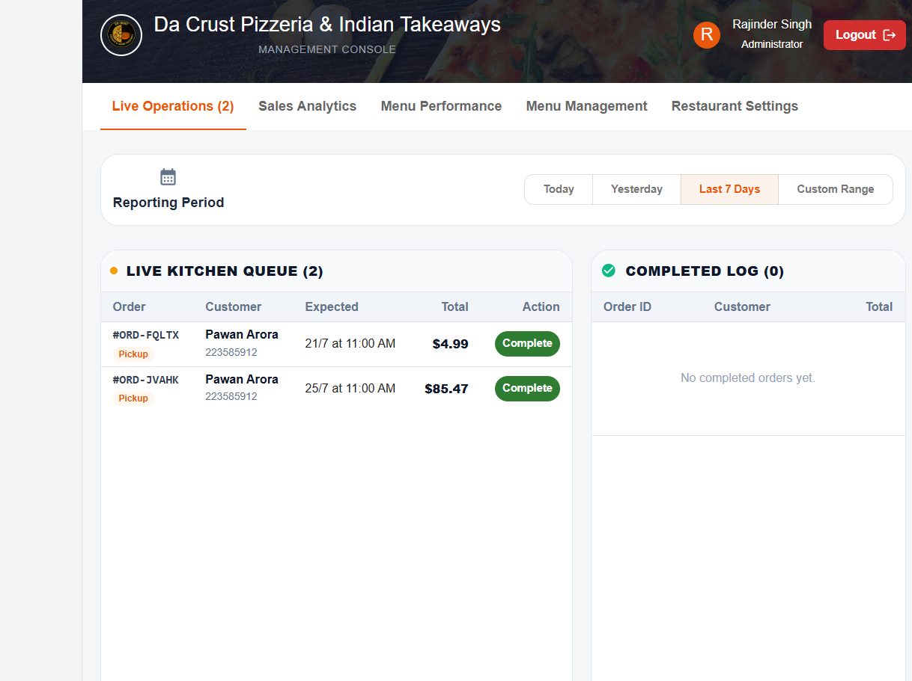
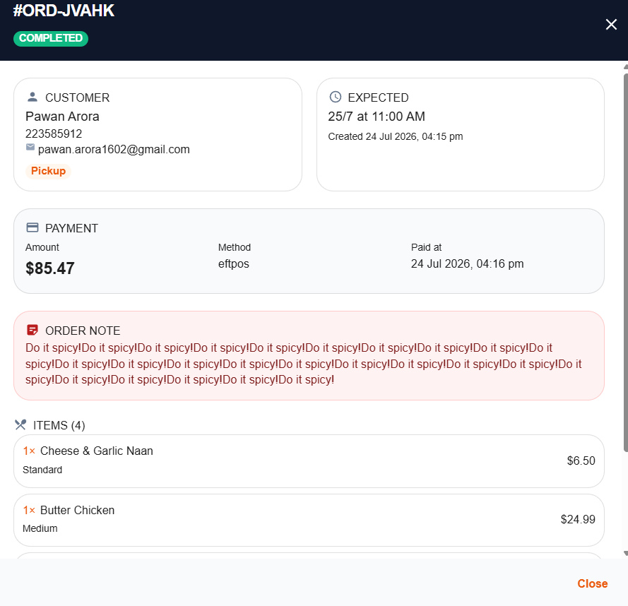
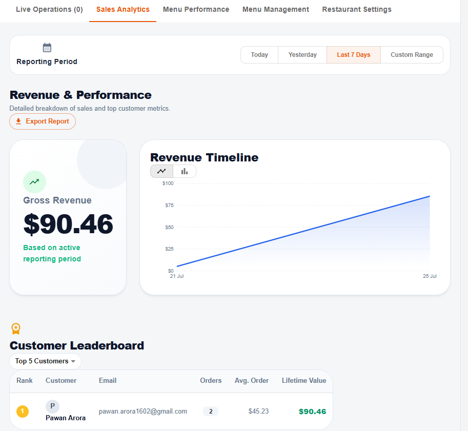
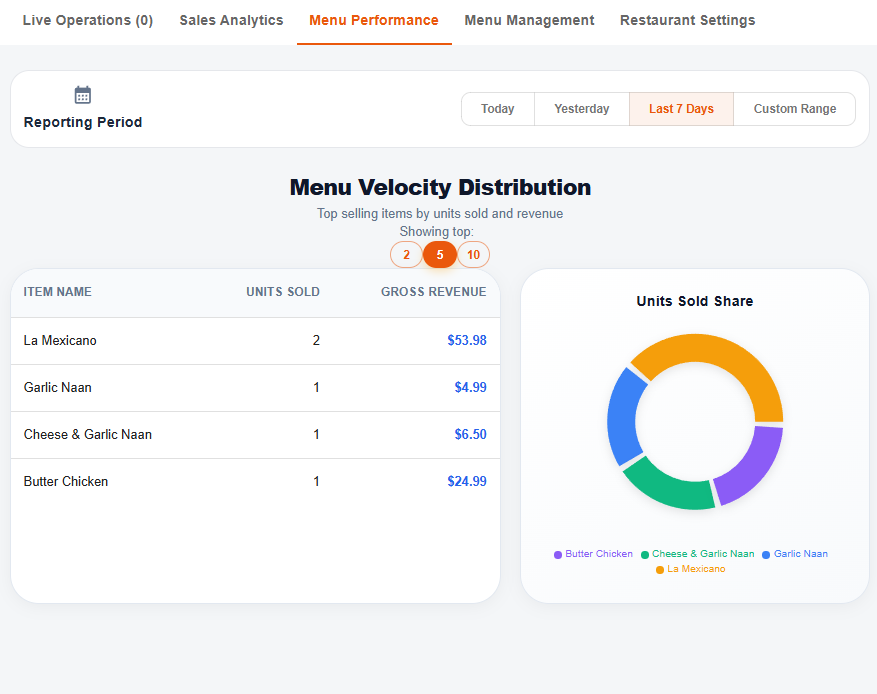
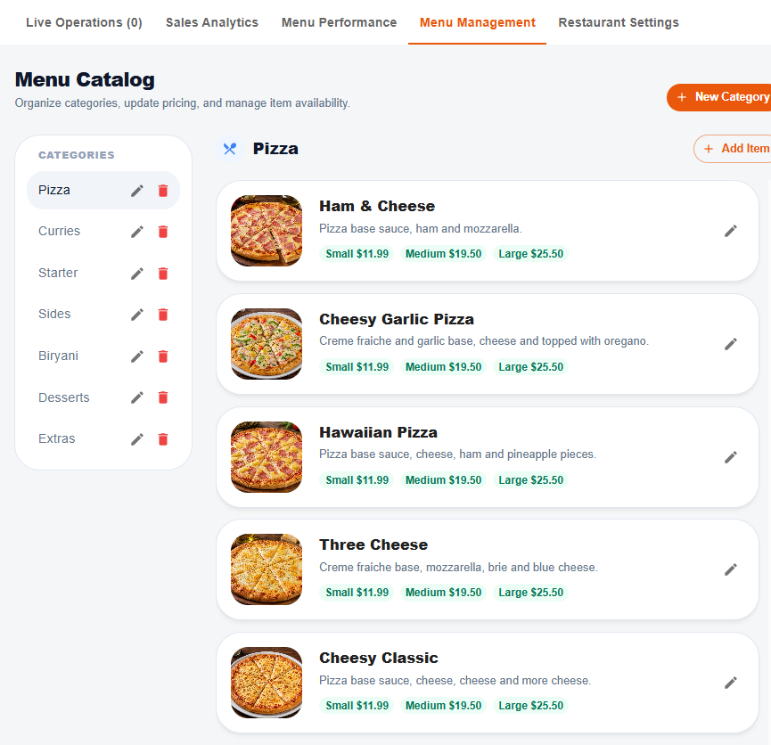
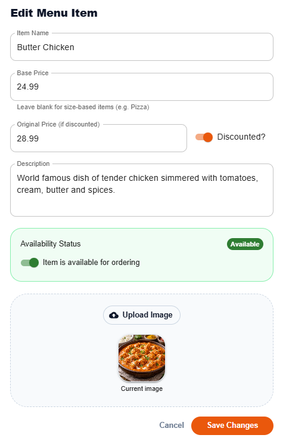
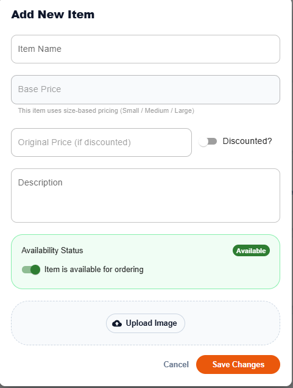
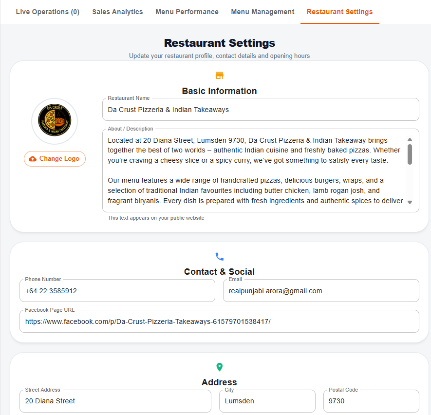
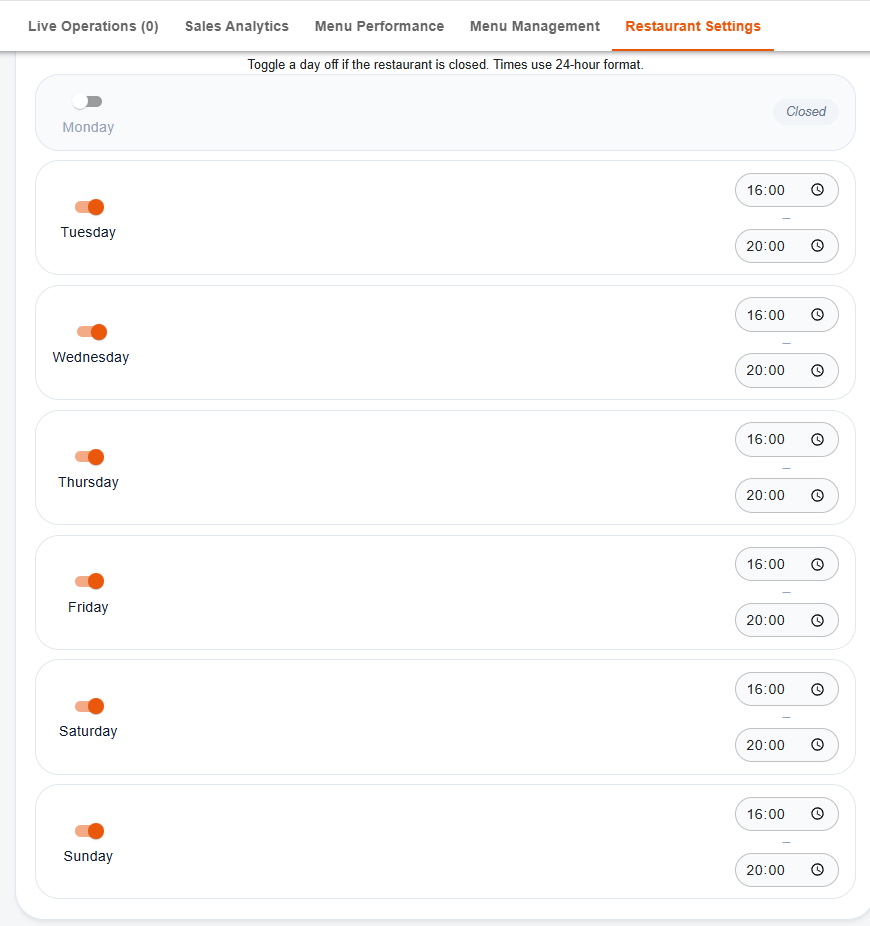

# Da Crust Management Console

React-based admin dashboard for managing **Da Crust Pizzeria & Indian Takeaways** — the restaurant's online ordering platform.

This console lets staff and owners handle live orders, view sales analytics, manage the full menu catalog, and update restaurant settings in real time.

---

## Screenshots

### Live Operations
Real-time kitchen queue and completed orders log. Staff can mark orders as complete and view full order details (customer info, payment method, special notes, and line items).





### Sales Analytics
Revenue overview with timeline chart, period filters (Today / Yesterday / Last 7 Days / Custom Range), and a customer leaderboard ranked by lifetime value. Reports can be exported.



### Menu Performance
See which items are selling best. View units sold, gross revenue, and share-of-sales pie chart. Filter the top 2 / 5 / 10 items.



### Menu Management
Full menu catalog with categories (Pizza, Curries, Starters, Sides, Biryani, Desserts, Extras).  
Add / edit categories and items, set size-based pricing, apply discounts, toggle availability, and upload images.







### Restaurant Settings
Update restaurant profile, logo, about text, contact details, social links, address, and daily opening hours (with the ability to mark any day as closed).





---

## Features

| Module              | Capabilities                                                                 |
|---------------------|------------------------------------------------------------------------------|
| **Live Operations** | Live kitchen queue, mark orders complete, order detail modal, completed log |
| **Sales Analytics** | Gross revenue, revenue timeline, customer leaderboard, period filters, export |
| **Menu Performance**| Top-selling items, units sold, revenue share pie chart                      |
| **Menu Management** | Categories & items CRUD, size pricing, discounts, availability, image upload |
| **Restaurant Settings** | Name, about, logo, phone, email, Facebook, address, opening hours        |

---

## Tech Stack

- **Frontend**: React
- **Backend / Data**: Firebase (Firestore + Storage)
- **Purpose**: Admin panel for the Da Crust customer-facing ordering website/app

---

## Getting Started

```bash
# Install dependencies
npm install

# Start development server
npm start

# Build for production
npm run build
```

---

## Notes

- Opening hours use 24-hour format.
- Days without an entry in the opening-hours map are treated as closed.
- Menu items support both fixed base price and size-based pricing (Small / Medium / Large).
- All times and reporting periods are aligned with the restaurant’s New Zealand timezone (Pacific/Auckland).

---

## License

Private – for Da Crust Pizzeria & Indian Takeaways internal use only.
